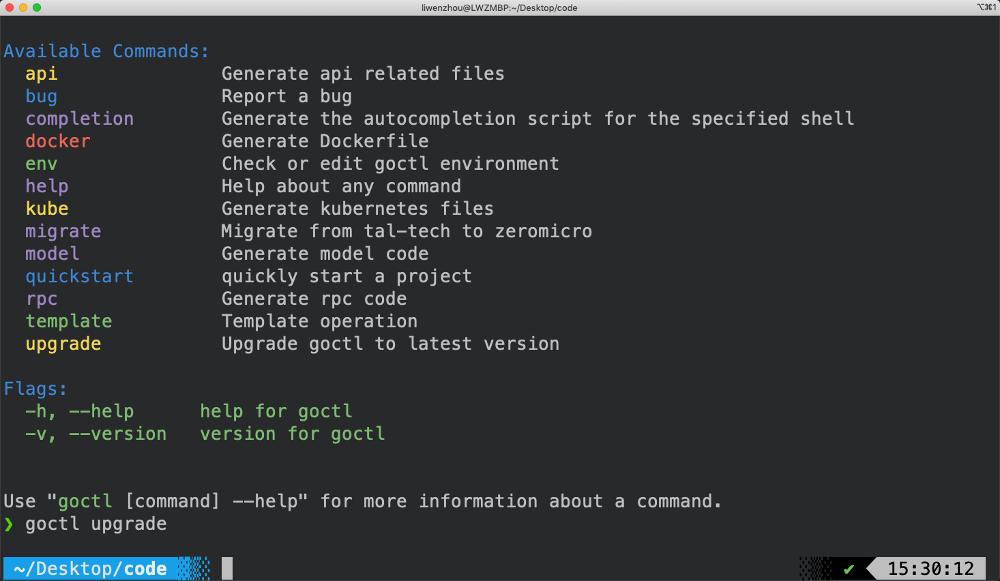

# gozero教程

**开源软件变化快，一切以官方文档为准。**

**开源软件变化快，一切以官方文档为准。**

**开源软件变化快，一切以官方文档为准。**


go-zero官方网站：[https://go-zero.dev/cn](https://go-zero.dev/cn)

go-zero代码库：[https://github.com/zeromicro/go-zero](https://github.com/zeromicro/go-zero)


## 介绍


api文件   --> goctl工具 --> 一键生成


## goctl工具

[https://go-zero.dev/cn/docs/goctl/goctl/](https://go-zero.dev/cn/docs/goctl/goctl/)

### 安装


```bash
go install github.com/zeromicro/go-zero/tools/goctl@latest
```

go install 安装命令行工具的，安装到`$GOPATH/bin` 这个目录下

```bash
❯ goctl --version
goctl version 1.4.4 darwin/amd64
❯ goctl -v
goctl version 1.4.4 darwin/amd64
```

安装protoc相关依赖

如果要生成 RPC 代码，需要安装protoc和go插件，参照我之前的protobuf教程博客或视频。

简单方法：

```bash
goctl env install
```



### 使用

常用的三个指令

```bash
goctl api 指令
goctl rpc 指令
goctl model 指令
```

#### api指令

根据api文件生成代码

https://go-zero.dev/cn/docs/goctl/api

#### rpc指令

根据`.proto`文件生成代码

https://go-zero.dev/cn/docs/goctl/zrpc

model指令

根据`ddl`或数据源生成代码

https://go-zero.dev/cn/docs/goctl/model


